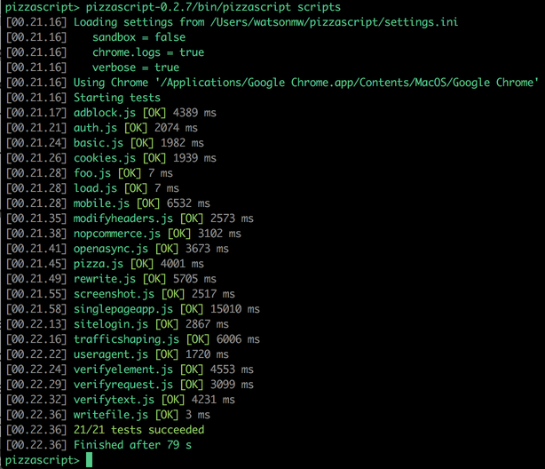
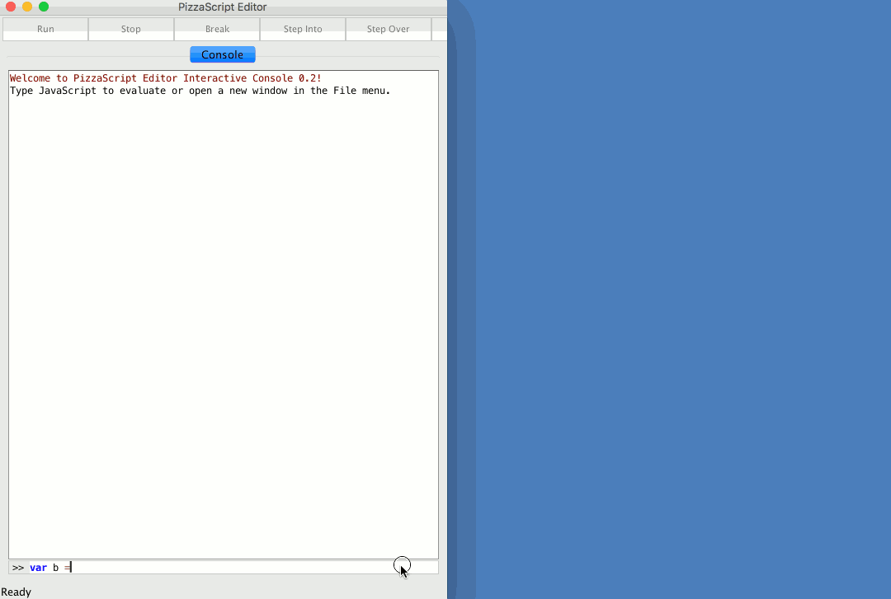

[](https://travis-ci.org/loadtestgo/pizzascript)
[](https://circleci.com/gh/loadtestgo/pizzascript)
[](https://ci.appveyor.com/project/loadtestgo/pizzascript)
[](https://github.com/loadtestgo/pizzascript/blob/master/LICENSE.BSD)
[](https://gitter.im/pizzascript/Lobby)

#### [Homepage](http://pizzascript.org) | [API Reference](http://pizzascript.org/api) | [Examples](https://github.com/loadtestgo/pizzascript/wiki/Examples)

# PizzaScript - Browser Automation & Webpage Performance Testing

PizzaScript is a JavaScript browser automation framework that records detailed webpage performance metrics.

It uses the Chrome DevTools Extensions API, so no external driver is required.

It includes:

- A script recorder / editor, with a [REPL](https://en.wikipedia.org/wiki/Read%E2%80%93eval%E2%80%93print_loop)
  and debugger for interactively writing tests.
- A standalone script runner, for running a set of tests, capturing screenshots & performance metrics.
- A Java API, for embedding the script runner in your own projects.

## Features

- Inspect page load times and HTTP traffic.
- Wait on page load, HTTP traffic, elements to be visible
- Block/redirect certain URLs (e.g. block 3rd party beacon URLs)
- Modify request headers
- HTTP authenication support (Basic/Digest/NTLM)
- Emulate Mobile and Tablet devices
- Emulate network conditions (e.g. 3G/4G/Offline)
- Record WebSocket request/responses
- Take screenshots / Record video of page load
- Many useful CSS selector extensions (e.g. "a:contains(Click me!)" selects a link with the
  text "Click me!")
- Easy integration with Jenkins / CircleCI / Appveyor / Travis

## Try It!

First make sure the following are installed:

+ Chrome 40+
+ Java 8 JRE

Then download the latest [PizzaScript](https://github.com/loadtestgo/pizzascript/releases/download/v0.2.8/pizzascript-0.2.8.zip) release.

To open the script recorder:

    bin/pizzascript-ide


To run a script and generate a report:

    bin/pizzascript scripts/basic.js


To run a performance test as a continuous integration job see [Jenkins Setup](https://github.com/loadtestgo/pizzascript/wiki/Jenkins-Setup)

The Chrome executable will be picked up from well-known Chrome install locations, if not found there then the PATH is searched.  See [Chrome Setup](https://github.com/loadtestgo/pizzascript/wiki/Chrome-Setup) for troubleshooting and/or manually configuring the Chrome location.

Tested on Linux, OSX and Windows.

## Runner



## Script Recorder



## Examples

### Load Page

```javascript
b = pizza.open("www.google.com");
b.verifyText("Search");
```

### Site Login

```javascript
var b = pizza.open();
b.open("loadtestgo.com");
b.click("button:contains(Login)");
b.waitPageLoad();
b.type("#inputUsername", "demo@loadtestgo.com");
b.type("#inputPassword", "password");
b.click("button:contains(Login):nth(1)");
b.waitPageLoad();
```

### Load Mobile Site

```javascript
var b = pizza.open();
b.emulateDevice("Apple iPhone 6")
b.open("cnn.com");
```

## Alternatives

* [Browsertime](https://github.com/sitespeedio/browsertime) - Access the Web Performance Timeline, from your browser, in your terminal!
* [Lighthouse](https://github.com/GoogleChrome/lighthouse) - Auditing and performance metrics for Progressive Web Apps.
* [PhantomJS](http://phantomjs.org) - Drive a headless browser using JavaScript, take screenshots and capture performance metrics.
* [WebPageTest](https://www.webpagetest.org) - Test a site's peformance from many different locations with a wide variety of browsers.
