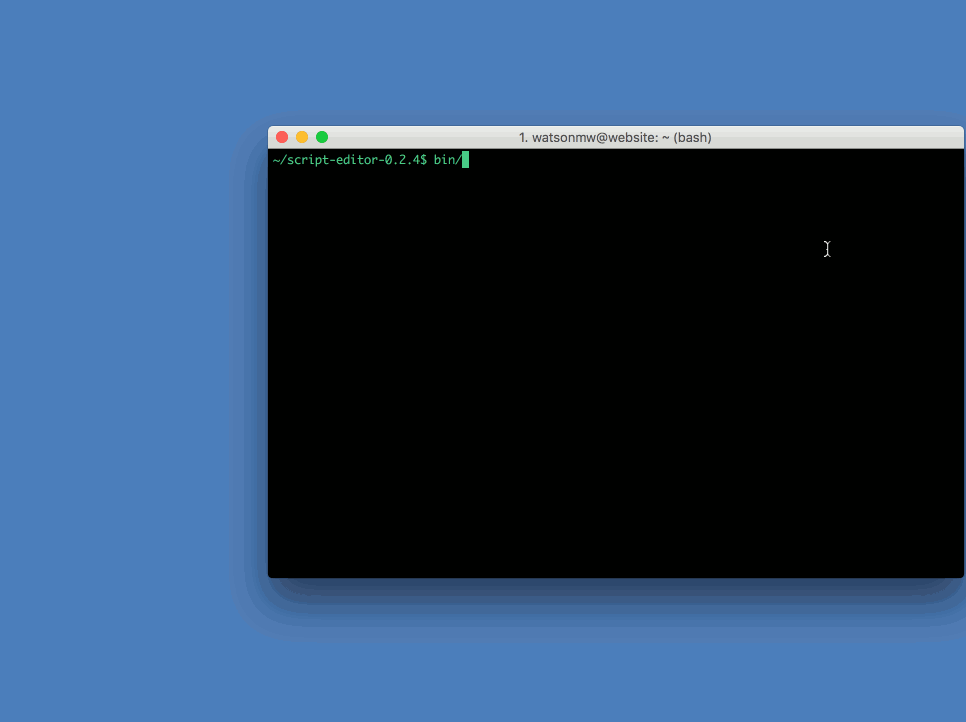

[](https://travis-ci.org/loadtestgo/pizzascript)
[](https://github.com/loadtestgo/pizzascript/blob/master/LICENSE.BSD)

# PizzaScript - Browser Automation & Performance Monitoring

PizzaScript is a JavaScript browser automation framework with built-in performance monitoring.

It includes a script editor, with a REPL and debugger for interactively writing tests.

## Features

- Inspect page load times and HTTP traffic
- Wait on page load, HTTP traffic, elements to be visible
- Many useful CSS selector extensions (e.g. "a:contains(Click me!)" selects a link with the
  text "Click me!")
- Take screenshots
- Block/redirect certain URLs (e.g. block 3rd party beacon URLs)
- Modify request headers
- Emulate Mobile and Tablet devices
- Emulate network conditions (e.g. 3G/4G/Offline)
- Record WebSocket request/responses

## Documentation

Docs for the Scripting API can be found here:

  http://docs.loadtestgo.com

These are generated from the files under [script-api](https://github.com/loadtestgo/pizzascript/tree/master/script-api).

## Try It!

First install the following:

+ Chrome 40+
+ Java 8 JRE

Download the latest [Script Editor](https://github.com/loadtestgo/pizzascript/files/365310/script-editor-0.2.4.zip) release.

Open the IDE:

    bin/script-editor

Open a file in IDE:

    bin/script-editor samples/google.js

Run a script from the console and save a HAR (HTTP Archive) file:

    bin/script-editor -console samples/google.js -har

Run the interactive console:

    bin/script-editor -console




## Example: Load Page

```javascript
b = pizza.open("www.google.com");
b.verifyText("Search");
```

## Example: Site Login

```javascript
var b = pizza.open();
b.open("loadtestgo.com");
b.click("button:contains(Login)");
b.waitPageLoad();
b.type("#inputUsername", "demo@loadtestgo.com");
b.type("#inputPassword", "password");
b.click("button:contains(Login):nth(1)");
b.waitPageLoad();
```

## Example: Load Mobile Site

```javascript
var b = pizza.open();
b.emulateDevice("Apple iPhone 6")
b.open("cnn.com");
```

## FAQ

**Q: How does this project differ from Selenium / WebDriver?**

A: The main thing is performance metrics (page load, first render time, HTTP requests)
are recorded as the page is interacted with.  You can use a proxy with Selenium,
but doing can cause the timing / concurrency to change and introduce subtle changes to
how requests are made.

Other differences include:

- The PizzaScript API is simple and use case driven.  We want you to be able write tests
  without the API getting in your way.  We're not trying to make the API overly Object
  Orientated, or limiting what you can automate to what a real user would do.
- It works with modern dynamic apps without requiring complex wait logic and retry
  wrapper functions.
- You can trigger script failures on HTTP status codes.
- The source code is much-much smaller and understandable.
- Element visibility errors are more detailed, making certain failures easier to debug.
- There's a built-in IDE for debugging and running scripts.

There are things Selenium does better though, not least of which is the compressive
browser support.  If you want to run scripts on a wide range of browser Selenium based
testing is a better choice.

**Q: Is there a script recorder?**

A: There's an IDE for writing and debugging scripts. CSS selectors can be generated
for HTML elements by clicking on them.  This makes it very efficient to write scripts
once you have a basic understanding of the API.

**Q: What browsers are supported?**

A: Currently only Chrome is supported.  Firefox and Edge support is on the roadmap.
Support for emulating mobile browsers in Chrome is available right now.

## Implementation Details

- Script are written in JavaScript and executed using Java Rhino.

- Chrome is launched and controlled from the Java process.

- Communication to Chrome is over a WebSocket, a Chrome extension creates the WebSocket
  and connects to the Java process.  From there Rhino calls to the browser object are
  sent over the WebSocket using an RPC mechanism.  Our Chrome extension handles these
  requests.

- The Chrome extension is written in JavaScript and talks to the Chrome Extension API &
  the DevTools API to implement its automation features.
